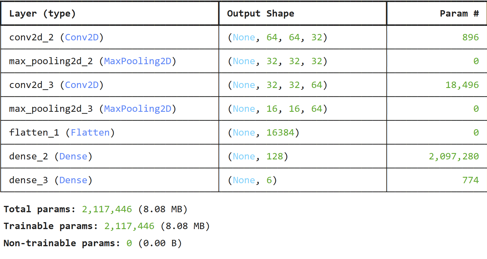
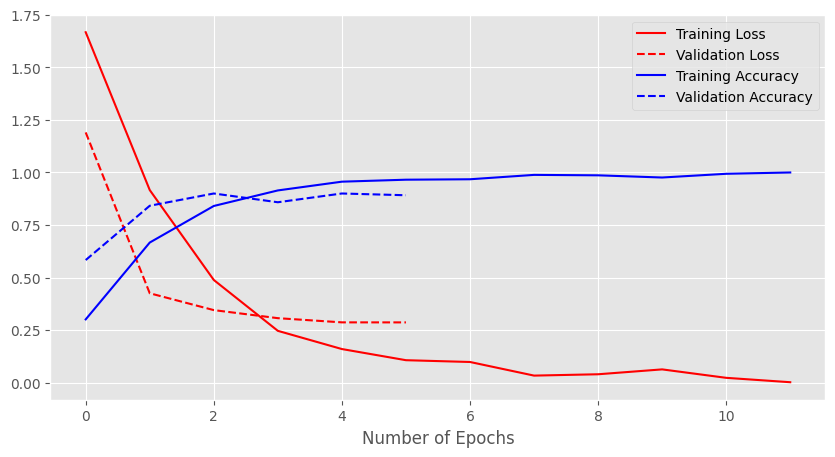
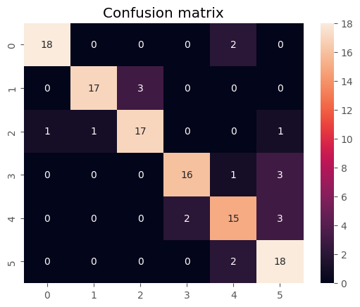
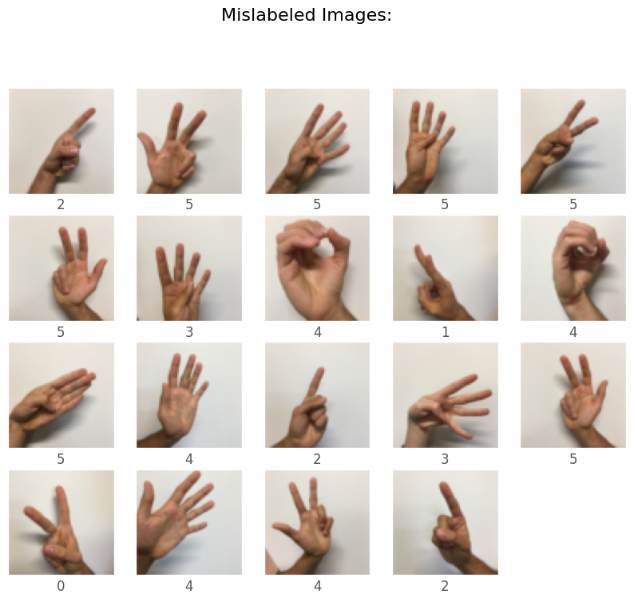
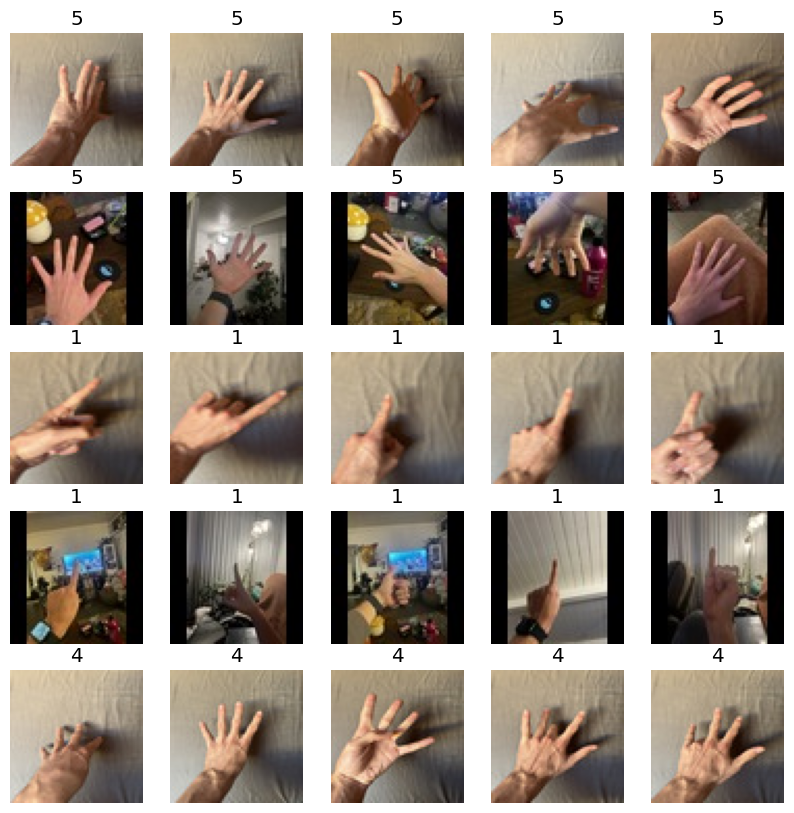
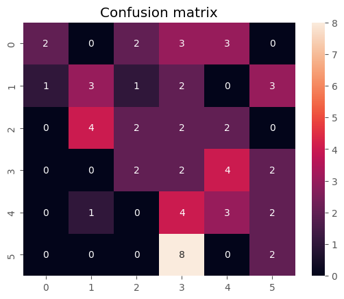

# Sign Language Classification  
### Max Clark, Lukas Schneider, Rowan King, Brendan McGuinness  
  
This project intends to train a Convolutional Neural Network (CNN) to classify images of hands based on how many fingers the hand is holding up. We initially use a dataset from Kaggle for training and testing, and then attempt to apply the model to new, less uniform data that may encountered in the real world.

---

## Objectives  

- Verify class balance and stratification across training and testing splits
- Build and train a CNN to classify images based on the number of fingers raised in the image
- Analyze model successes and failures in testing
- Apply CNN to our own dataset designed to challenge the model

---

## Repository Structure

```
|---jpeg_images                        # Self-made dataset of images
|      |---0                           # Sub-folders containing specified classes of images
|      |---1
|      |---2
|      |---3
|      |---4
|      |---5
|---visualizations                     # Project visualizations
|      |---model_structure.png
|      |---real_world_matrix.png
|      |---real_world_set.png
|      |---test_matrix.png
|      |---test_mislabeled.png
|      |---training_loss.png
|---README.md
|---SignLanguageClassification.ipynb   # Final Project Jupyter Notebook
|---test.h5                            # test dataset
|---train.h5                           # train dataset
```

---

## Methodology

### Dataset
- Sourced from Kaggle user Shivam Aggarwal ([link](https://www.kaggle.com/datasets/shivamaggarwal513/dlai-hand-signs-05)) containing images of the user's hand as he holds up a number of fingers from 0 to 5
- Pre-split into train (1080 images) and test (120 images) sets
- Classes labels: `0`, `1`, `2`, `3`, `4`, and `5`, corresponding to the number of fingers held up in the image of the hand

### Workflow
1. **Data Processing and EDA**: Converting data from .h5 format and ensuring class balance across subsets
2. **Image Data Generator Construction**: RGB rescaling with no further transformations for baseline performance measures
3. **Model Building**: 7-layer Convolutional Neueral Network
4. **Testing and Evaluation**: Accuracy used for testing metric
5. **Application to Real-World Dataset**: Testing using self-made dataset designed to challenge model

---

## Key Visualizations

### Model Structure


### Training Loss and Accuracy


### Testing Confusion Matrix


### Mislabeled Images


### Real-World Dataset


### Real-World Confusion Matrix


---

## Training/Validation Performance Summary

| Epoch | Accuracy  | Loss   | Validation Accuracy | Validation Loss |
|-------|-----------|--------|---------------------|-----------------|
| 1     | 0.1899    | 1.9373 | 0.5833              | 1.1906          |
| 2     | 0.6208    | 0.9947 |                     |                 |
| 3     | 0.8149    | 0.5409 | 0.8417              | 0.4253          |
| 4     | 0.9107    | 0.2502 |                     |                 |
| 5     | 0.9640    | 0.1399 | 0.9000              | 0.3452          |
| 6     | 0.9713    | 0.0943 |                     |                 |
| 7     | 0.9724    | 0.0855 | 0.8583              | 0.3069          |
| 8     | 0.9846    | 0.0381 |                     |                 |
| 9     | 0.9826    | 0.0441 | 0.9000              | 0.2869          |
| 10    | 0.9842    | 0.0449 |                     |                 |
| 11    | 0.9863    | 0.0415 | 0.8917              | 0.2868          |
| 12    | 1.0000    | 0.0022 |                     |                 |

### Key Insights

- For the first 4 epochs, the training accuracy rose rapidly, but slowed for the remaining 8 epochs
- Validation accuracy peaked after the 4th epoch, and made no consistent improvements afterwards
- Despite the plateau in validation accuracy, validation loss continued to decrease throughout the 12 epochs

## Testing Performance Summary

| Test Accuracy  | Test Loss  |
|----------------|------------|
| 0.9083         | 0.3267     |

| Label/Prediction  | 0  | 1  | 2  | 3  | 4  | 5  |
|-------------------|----|----|----|----|----|----|
| 0                 | 18 | 0  | 0  | 0  | 2  | 0  |
| 1                 | 0  | 17 | 3  | 0  | 0  | 0  |
| 2                 | 1  | 1  | 17 | 0  | 0  | 1  |
| 3                 | 0  | 0  | 0  | 16 | 1  | 3  |
| 4                 | 0  | 0  | 0  | 2  | 15 | 3  |
| 5                 | 0  | 0  | 0  | 0  | 2  | 18 |

### Key Insights

- Validation accuracy and loss were very close to test accuracy and loss, indicating little to no overfitting
-  
